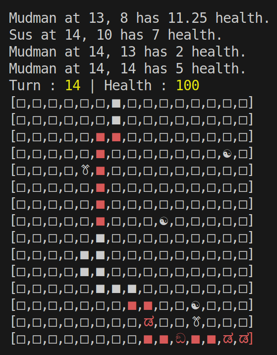

# Tower-Defense

This is a school project done in early-mid 2023. The goal was to create from scratch a [tower defense](https://en.wikipedia.org/wiki/Tower_defense) game in TS. The twist was the (mandatory) use of functional programming which is, let's be honest, not really adapted to games.
Nonetheless, we did our best to respect the chosen paradigm. That is a reason why our code is messy and really difficult to read  (an other reason being us being bad :pepeKMS:). The game is displayed in the terminal.

The game board is a square. The path is randomly generated. Turn after turn, monsters randomly spawn on one extremity of the path and try to reach the opposite. Towers are randomly spawn outside of the path, on field cells.

## File

- `/dist` : build directory
- `/src`
  - `actor.ts` : defines the type `actor` used for both towers and monsters
  - `characters.ts` : generic entities (towers and monsters) created from `actor`
  - `display.ts` : display functions (in terminal)
  - `game.ts` : `main` function
  - `monster.ts` : all functions related to monsters
  - `structures.ts` : contains all custom data structures (all recursive of course) and their utilitary functions
  - `tower.ts` : all functions related to towers
  - `world.ts` : management of the game board
- `/tst` : contains all test files (please not that some tests in `world.test.ts` dont pass. Will probably never be fixed).
- `Makefile` : see below
- `jest.config.ts` : Jest configuration file (framework used for tests)
- `package.json` : dependencies files
- `tsconfig.json` : TypeScript configuration file

## How to Makefile

First, needed packages need to be installed. So please run `npm install` in the repository root (it will install all dependencies from `package.json`)

This project use a Makefile to compile and run executables. Run the following commands in the repository root depending on your needs.
- `make` : compile the whole project and runs it
- `make build` : compile only the main files (no tests)
- `make run` : compile only the main files and run the project (same as `make`)
- `make test` : compile the project and tests files and run all tests with Jest
- `make test_coverage` : compile and run tests, and display the coverage.
- `make clean` : delete all compiled files (in `/dist`)

Different parameters such as board dimension, towers' and monsters' spawn rate and stats can be manually modified in corresponding files.

## Screenshot

The path is represent by filled cells while field cells are empty. The two types of towers are represented by ☯ and ꔢ and the two type of monsters by ಡ and ඞ. Path cells (with a monster on it or not) in range of at least one tower are in red.

## Authors 

[PotatOwO](https://github.com/UnePatate5010)

[Larwive](https://github.com/Larwive)

[GeekBoyBoss](https://github.com/GeeKboy2)

[Pyrhanox](https://github.com/Pyrhanox)
